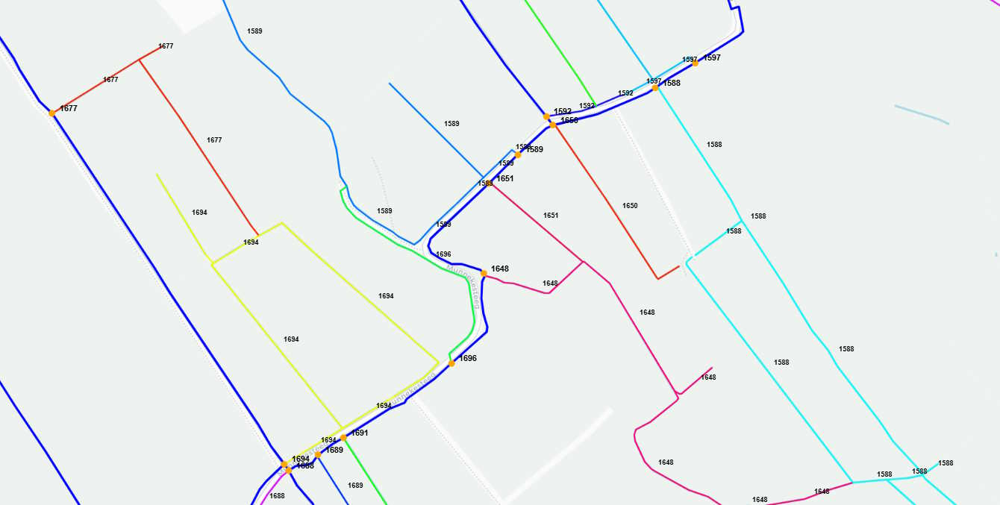
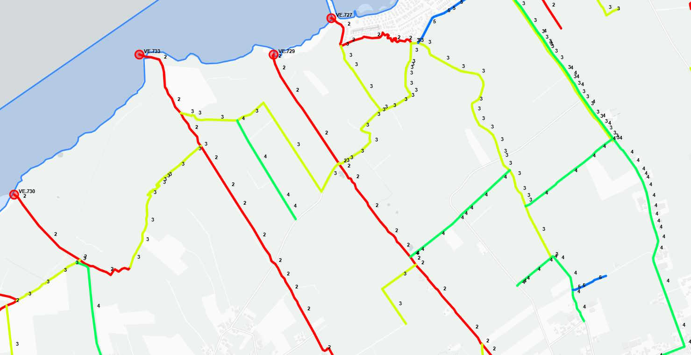
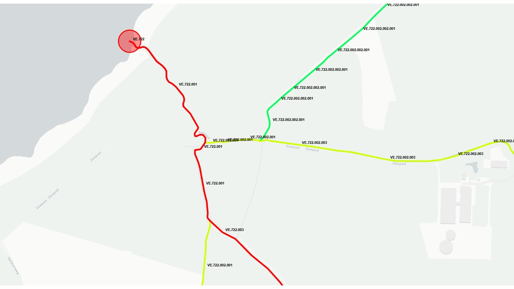
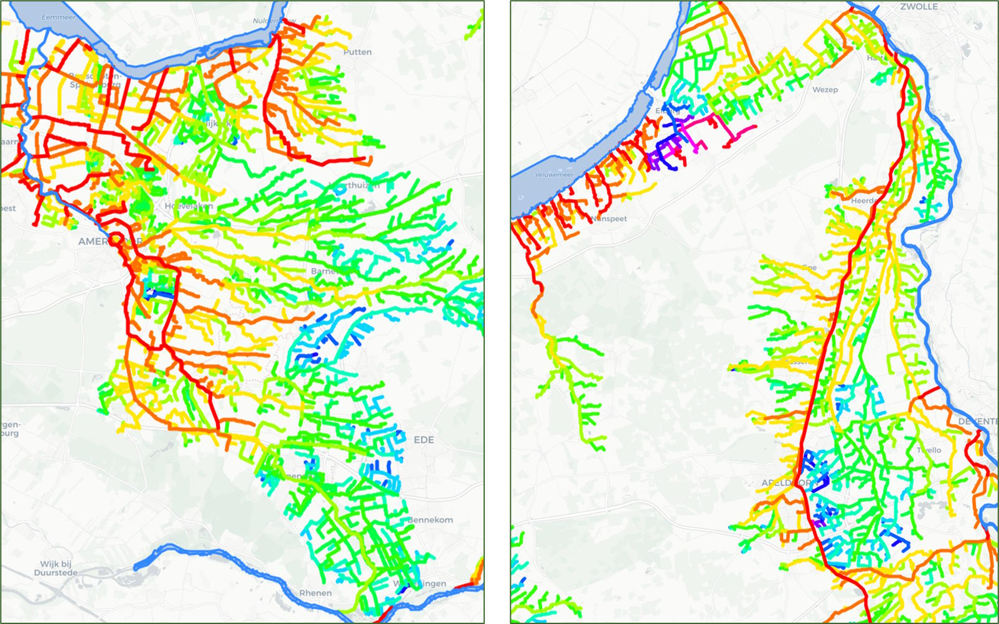
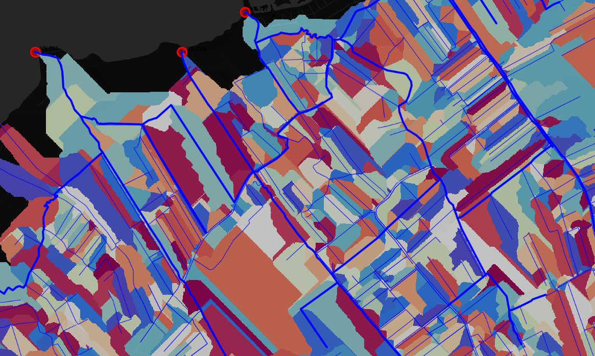
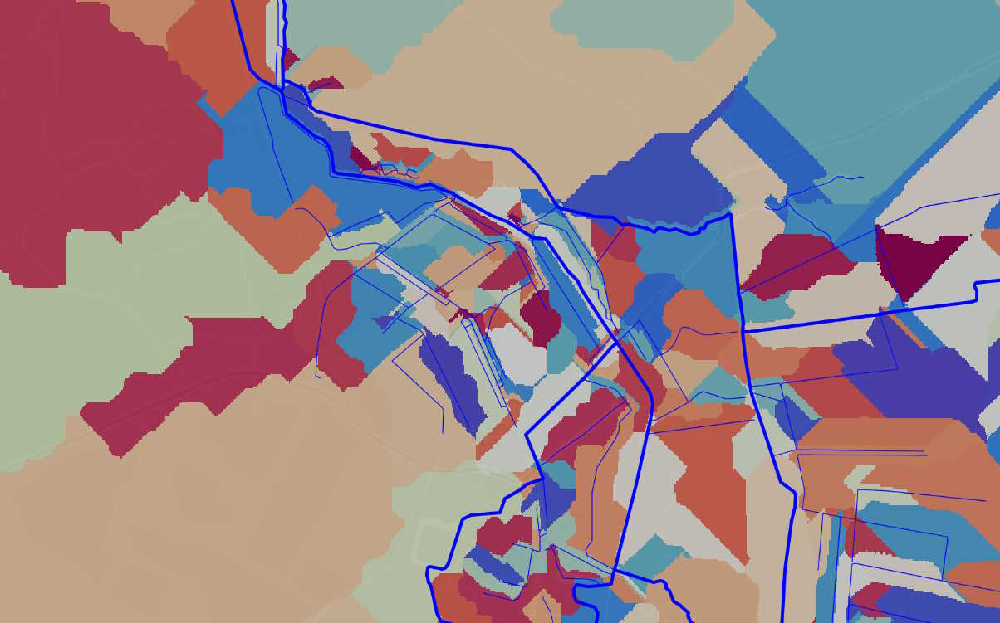

Beschrijving van de workflows
============================

Voorbewerkingen op de basisdata (preprocessing)
^^^^^^^^^^^^^^^^^^^^^^^^^^^^
De voorbewerkingen die zijn uitgevoerd op de basisdata bestaan uit twee types:

* Handmatige aanpassingen: Een los script met twee geopackages wordt gebruikt om vooraf elementen uit de basisdata te verwijderen, aan te passen of toe te voegen. Dit blijkt nodig te zijn, omdat sommige watergangen in de praktijk niet verbonden zijn met deelnetwerken of omdat de richting van A-/B-watergangen verkeerd geregistreerd staat. Waar deze correcties nodig zijn, is soms lastig te achterhalen met behulp van coderen.
* Automatische aanpassingen: Bij veel A-/B-watergangen sluiten de ingetekende lijnstukken niet exact op elkaar aan, soms liggen de uiteindes maar centimeters of milimeters van elkaar af. Er wordt een correctie toegepast op de lijnelementen (snapping) om dit op te lossen en een sluitend netwerk te maken. Dit gaat voornamelijk om de hydroobjecten die ook apart worden opgeslagen in de resultaat map (hydroobjecten_snapped.gpkg).

De automatische voorbewerkingen (snapping) worden voorlopig nog uitgevoerd in de GeneratorCulvertLocations.

GeneratorCulvertLocations (workflow Duiker Locaties)
^^^^^^^^^^^^^^^^^^^^^^^^^^^^
Doel van deze workflow is het verbinden van de C-watergangen met de A-/B-watergangen: dit om te bepalen welke gebieden waar aansluiten op de hoofdwatergangen van het waterschap. 
De C-watergangen zijn in beheer van gemeentes of perceeleigenaren en hiervan is vaak beperkt data beschikbaar. 
Ook vormen de greppels en sloten vaak een verweven netwerk en wil men graag weten welke delen nu waar naartoe afstromen. 

De workflow bestaat uit de volgende stappen:

* Zoekt alle mogelijke verbindingen (duikers) tussen losliggende C-watergangen en de hoofdwatergangen (A/B);
* Bepaalt voor elke mogelijke verbinding/duiker of er een snelweg/spoor/weg of peilgebiedsgrens wordt gekruist;
* Voorziet elke mogelijke verbinding/duiker van een score op basis van criteria (kruisingen, lengte duiker, richting duiker t.o.v. watergang);
* Zoekt de duikers met de hoogste scores tussen losliggende C-watergangen en daarmee ook de verbindingen met de hoofdwatergangen (A/B);
* De richting van de C-watergangen wordt bepaald door de kortste afstand tot een hoofdwatergang te zoeken. Idealiter zou hier gekeken worden naar het verhang richting een uitstroompunt op een hoofdwatergang.

Zie ook:

* `Issue #12 <https://github.com/Sweco-NL/generator_drainage_units/issues/12#issuecomment-2446702722>`_: Selectie beste duiker 

.. image:: _static/generator_culvert_locations_1.jpg
    :alt: Generator Order Levels (workflow duiker-generator)
    :width: 800px
    :align: center

Figuur: duikergenerator - het vinden van de verbindingen van de C-watergangen

Figuur: afleiden stroomrichting C-watergangen naar A-/B-watergangen (nu kortste route)

GeneratorOrderLevels (workflow Orde-codering)
^^^^^^^^^^^^^^^^^^^^^^^^^^^^
Doel van deze workflow is het bepalen van orde nummers en de orde-codering voor iedere watergang, zodat de codes vervolgens gekoppeld kunnen worden aan de afwateringseenheden/afvoergebieden die aan de watergang gelinkt zijn. 
Hiervoor wordt voor de A-/B-watergangen uitgegaan van de methode beschreven in de `Leidraad Harmoniseren Afvoergebieden <https://kennis.hunzeenaas.nl/file_auth.php/hunzeenaas/a/aa/Leidraden_Harmoniseren_Afvoergebieden_v1.1.pdf>`_. 

De workflow bestaat (op dit moment) uit de volgende stappen, werkend van beneden- naar bovenstrooms:

* De RWS-wateren waar de watergangen in uitstromen vormen de basis voor de codering (bijv. Veluwemeer: VE, IJssel: IJ, zie leidraad voor overzicht codes). De code van het RWS-water wordt gevolgd door een punt ('.');
* De A-/B-watergangen die uitstromen in het betreffende RWS-water zijn van de 2e orde en krijgen een driecijferig nummer toegewezen dat binnen een range ligt die is gespecificeerd voor het waterschap (bijv. Vallei&Veluwe: 712-760, zie leidraad voor range per waterschap). Dit nummer wordt achter de code van het RWS-water gevoegd. Voorbeeld: De Leuvenumsebeek (zie onderstaande figuren) krijgt als code VE.733. Per uitstroompunt zou deze code vastgelegd moeten worden;
* Ieder individueel watergangsdeel krijgt een opvolgend driecijferig nummer (gescheiden van de basiscode door een punt, bijv. VE.733.001, VE.733.002) of er kan voor gekozen worden pas onderscheid te maken in watergangsdelen op punten waar A-/B-watergangen splitsen;
* Een instromende A-/B-watergang wordt als een orde hoger geregistreerd (3, 4, 5, etc.) en wordt als gehele zijtak ook meegenomen in de nummering;
* Bij splitsingen of samenvloeiingen wordt ervan uit gegaan dat twee watergangsdelen die in het verlengde van elkaar liggen van dezelfde orde zijn. Deze krijgen dus ook hetzelfde orde nummer;
* De C-watergangen die uitstromen op een A-/B-watergang worden een orde hoger geregistreerd dan de watergang waar ze in uitstromen en krijgen dezelfde codering mee (met aanvulling C0001, C0002, ...). Hieruit kan afgeleid worden welke C-watergangen met bijbehorende afvoergebieden bij een watergang horen.

Zie ook: 

* `Issue #16 <https://github.com/Sweco-NL/generator_drainage_units/issues/16#issuecomment-2558479293>`_: Codering RWS wateren en uitstroompunten
* `Issue #17 <https://github.com/Sweco-NL/generator_drainage_units/issues/17#issuecomment-2516835304>`_: Definitie orde A-/B-watergangen
* `Issue #18 <https://github.com/Sweco-NL/generator_drainage_units/issues/18#issue-2629773652>`_: Definitie orde C-watergangen
* `Issue #19 <https://github.com/Sweco-NL/generator_drainage_units/issues/20#issuecomment-2558543651>`_: Definitie orde-codering

Figuur: Afleiden orde nummer van de A-/B-watergangen

Figuur: Afleiden orde codering van de A-/B-watergangen

Figuur: Orde nummer van de A-/B-watergangen voor het gehele beheergebied van waterschap Vallei & Veluwe

GeneratorDrainageUnits (workflow Afwateringseenheden)
^^^^^^^^^^^^^^^^^^^^^^^^^^^^
Doel van deze workflow is het genereren van afwateringseenheden (polygonen): op basis van een GHG raster 25x25m wordt de afvoerrichting bepaald en vervolgens per waterdeel welk gebied erop afstroomt (welke cellen liggen bovenstrooms). 
Er is voor gekozen om te werken met een berekend GHG raster (GHG: gemiddelde hoogste wintergrondwaterstand) omdat dit voor de afwatering representatiever is dan het gebruik van het maaiveld. Reden hiervoor is dat er voor het beheergebied van waterschap Vallei en Veluwe vooral sprake is van infiltratie en niet van oppervlakkige afstroming. 
Voor de analyse wordt gebruik gemaakt van een andere open source package `PyFlwDir van Deltares <https://github.com/Deltares/pyflwdir>`_ (Deltares). 
De workflow bestaat (op dit moment) uit de volgende stappen:

* Grof GHG raster wordt gedownscaled naar een opgegeven resolutie.
* Watergangen (lijnen) worden verrasterd. Om te zorgen dat afvoer realistisch richting de watergangen afstroomt wordt het fijne GHG-raster ter hoogte van de watergangen verdiept met 0.20 meter. Deze verlaging wordt minder hoe verder van de watergang.
* Voor het resulterende fijne GHG-raster wordt per cel bepaald welke stroomrichting het water in die cel heeft (local drainage direction);
* Per watergangsdeel wordt berekend welke cellen er bovenstrooms van liggen. Op de Veluwe kunnen cellen op wel 10-20km afstand liggen en alsnog op een watergang afwateren.

Figuur: afleiden afwateringseenheden - laaggelegen/polder

Figuur: afleiden afwateringseenheden - hogergelegen gebied / vrij-afwaterend

In principe werkt de methode om per watergang het afwaterende gebied te bepalen, alleen de methode kan nog verbeterd worden.
De gebruikte python-package PyFlwDir (net als PCRASTER en vergelijkbare methodes) maakt gebruik van de D8-methode om per cel de afstroomrichting te bepalen aan de hand van de laagste naastliggende cel.

.. image:: _static/ldd_d8.png
    :alt: Generator Drainage Units (ldd d8)
    :width: 300px
    :align: center

Omdat de acht stroomrichtingen slechts beperkt detail geven in de richting die het water op kan stromen, is er weinig detail terug te zien in de gegenereerde afwaterende eenheden op aflopende gebieden/hellingen. Voorbeeld: Bij de Leuvenumsebeek (zie onderstaande figuur) loopt het water voornamelijk in rechte lijnen richting het noordwesten.
Er wordt momenteel nog gekeken naar mogelijkheden om hier meer detail in aan te brengen.

Zie ook `Issue #50 <https://github.com/Sweco-NL/generator_drainage_units/issues/50>`_: Aanpassen D8-methode.

.. image:: _static/ghg_drainage_units_leuvenumsebeek.jpg
    :alt: Generator Drainage Units (ghg_leuvenumsebeek)
    :width: 800px
    :align: center

Figuur: Leuvenumsebeek, GHG (links) en afwateringseenheden per watergangsdeel (rechts)

GeneratorNetworkLumping (workflow aggregeren (deel)stroomgebieden)
^^^^^^^^^^^^^^^^^^^^^^^^^^^^
Workflow om voor opgegeven uitstroompunten het bovenstroomse watersysteem te lumpen en afvoergebieden of (deel)stroomgebieden te genereren. Hierbij wordt overlap gedetecteerd tussen deelstroomgebieden en kan men aangeven hoe de deelgebieden verdeeld worden.
De workflow bestaat (op dit moment) uit de volgende stappen:

* Inladen netwerk van het watersysteem en de bijbehorende afwateringseenheden;
* Definiëren (interne) uitstroomlocaties en harde knips in het netwerk;
* Per uitstroompunt zoeken naar gebied bovenstrooms op basis van het netwerk en de richting van de watergangen (deelstroomgebieden);
* Detecteren van overlap tussen deelstroomgebieden en bij welke splitsingen deze gebieden samen komen;
* Voor deze splitsingen bepalen welke richting prioriteit heeft;
* Deelstroomgebieden afronden door afwateringseenheden eraan te koppelen.

