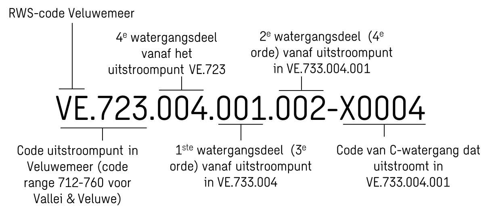
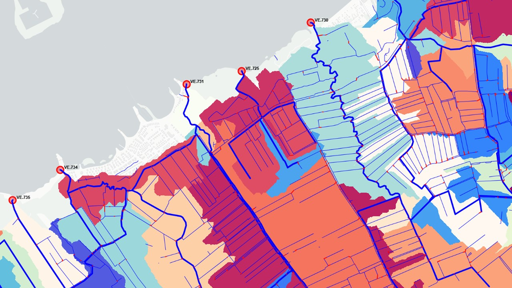
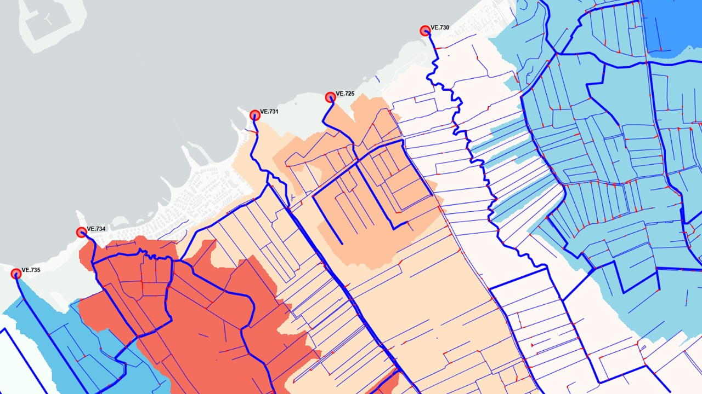

Beschrijving van de workflows
============================

Voorbewerkingen op de basisdata (preprocessing)
^^^^^^^^^^^^^^^^^^^^^^^^^^^^
De voorbewerkingen die zijn uitgevoerd op de basisdata bestaan uit twee types:

* Handmatige aanpassingen: Een los script met twee geopackages wordt gebruikt om vooraf elementen uit de basisdata te verwijderen, aan te passen of toe te voegen. Dit blijkt nodig te zijn, omdat sommige watergangen in de praktijk niet verbonden zijn met deelnetwerken of omdat de richting van A-/B-watergangen verkeerd geregistreerd staat. Dit is niet (of lastig) automatisch te herleiden en aan te passen.
* Automatische checks en aanpassingen: Bij verrassend veel A-/B-watergangen sluiten de ingetekende lijnelementen niet exact op elkaar aan en liggen de uiteinden centimeters of millimeters van elkaar af. Er wordt een correctie toegepast op de lijnelementen (snapping) om dit op te lossen en een sluitend netwerk te maken. Dit gaat voornamelijk om de hydroobjecten: de aanpassingen worden opgeslagen in hydroobjecten_snapped.gpkg.

De automatische voorbewerkingen (snapping) worden nu nog uitgevoerd binnen de GeneratorCulvertLocations.

GeneratorCulvertLocations (workflow Duiker Locaties)
^^^^^^^^^^^^^^^^^^^^^^^^^^^^
Doel van deze workflow is het verbinden van de C-watergangen met de A-/B-watergangen: dit om te bepalen welke gebieden waar aansluiten op de hoofdwatergangen van het waterschap. 
De C-watergangen zijn in beheer van gemeentes of perceeleigenaren en hiervan is vaak beperkt data beschikbaar. 
Ook vormen de greppels en sloten vaak een verweven netwerk en wil men graag weten welke delen nu waar naartoe afstromen. 

De workflow bestaat uit de volgende stappen:

* Zoekt alle mogelijke verbindingen (duikers) tussen losliggende C-watergangen en de hoofdwatergangen (A/B) met een opgegeven maximale lengte (standaard 40meter);
* Bepaalt voor elke mogelijke verbinding/duiker of er een snelweg/spoorweg/weg of peilgebiedsgrens wordt gekruist;
* Voorziet elke mogelijke verbinding/duiker van een score op basis van criteria (kruisingen, lengte duiker, richting duiker t.o.v. watergang);
* Selecteert de duikers met de hoogste scores tussen losliggende C-watergangen en de verbindingen met de hoofdwatergangen (A/B);
* De afvoerrichting van de C-watergangen is niet bekend en wordt bepaald door de kortste route te bepalen tot een hoofdwatergang. Idealiter zou hier gekeken worden naar het verhang richting een uitstroompunt op een hoofdwatergang.

Zie ook:

* `Issue #12 <https://github.com/Sweco-NL/generator_drainage_units/issues/12#issuecomment-2446702722>`_: Voor criteria waarop de beste duiker/verbinding wordt geselecteerd

.. image:: _static/generator_culvert_locations_1.jpg
    :alt: Generator Order Levels (workflow duiker-generator)
    :width: 800px
    :align: center

Figuur: Duikergenerator - Geselecteerde verbindingen/duikers (de rode lijntjes) tussen de C-watergangen onderling en met de A-/B-watergangen.

.. image:: _static/generator_culvert_locations_2.jpg
    :alt: Generator Order Levels (workflow duiker-generator)
    :width: 800px
    :align: center

Figuur: Afleiden welke C-watergangen bij welke uitstroompunten in de A-/B-watergangen horen (op basis van de kortste route). Hieruit kan de richting bepaald worden.

GeneratorOrderLevels (workflow Orde-codering)
^^^^^^^^^^^^^^^^^^^^^^^^^^^^
De `Leidraad Harmoniseren Afvoergebieden <https://kennis.hunzeenaas.nl/file_auth.php/hunzeenaas/a/aa/Leidraden_Harmoniseren_Afvoergebieden_v1.1.pdf>`_ schrijft voor hoe afvoergebieden gecodeerd kunnen worden.
De methode is gericht op afvoergebieden, maar omdat het systeem van watergangen hierin bepalend is, kan de orde-codering daarvoor bepaald worden. De orde-code van iedere watergang kan eenvoudig later gekoppeld worden aan de bijbehorende afwateringseenheid of afvoergebied.

Doel van deze workflow is het bepalen van orde-nummers en de orde-codering voor iedere watergang, zodat de codes vervolgens gekoppeld kunnen worden aan de afwateringseenheden/afvoergebieden. 
De watergangen die uitstromen in RWS-wateren zijn van de 2e orde, de watergangen die daarop instromen zijn dan van de 3e orde, enz. De orde-codering is als volgt opgebouwd:

De workflow bestaat (op dit moment) uit de volgende stappen, werkend van beneden- naar bovenstrooms:

* De RWS-wateren waar de watergangen in uitstromen vormen de basis voor de codering (bijv. Veluwemeer: VE, IJssel: IJ, zie leidraad voor overzicht codes). De code van het RWS-water wordt gevolgd door een punt ('.');
* De A-/B-watergangen die uitstromen in het betreffende RWS-water zijn van de 2e orde en krijgen een driecijferig nummer toegewezen dat binnen een range ligt die is gespecificeerd voor het waterschap (bijv. Vallei&Veluwe: 712-760, zie leidraad voor range per waterschap). Dit nummer wordt achter de code van het RWS-water gevoegd. Voorbeeld: De Leuvenumsebeek (zie onderstaande figuren) krijgt als code VE.733. Per uitstroompunt zou deze code vastgelegd moeten worden;
* Ieder individueel watergangsdeel krijgt een opvolgend driecijferig nummer (gescheiden van de basiscode door een punt, bijv. VE.733.001, VE.733.002) of er kan voor gekozen worden pas onderscheid te maken in watergangsdelen op punten waar A-/B-watergangen splitsen;
* Een instromende A-/B-watergang wordt als een orde hoger geregistreerd (3, 4, 5, etc.) en wordt als gehele zijtak ook meegenomen in de nummering;
* Bij splitsingen of samenvloeiingen wordt ervan uit gegaan dat een watergang dat in het verlengde van de benedenstroomse tak ligt nog van dezelfde orde is. Andere watergangen worden gezien als instromende takken die een orde hoger zijn;
* De C-watergangen die uitstromen op een A-/B-watergang worden een orde hoger geregistreerd dan de watergang waar ze in uitstromen en krijgen dezelfde codering mee (met aanvulling C0001, C0002, ...). Hieruit kan afgeleid worden welke C-watergangen met bijbehorende afvoergebieden bij een watergang horen.

Zie ook: 

* `Issue #16 <https://github.com/Sweco-NL/generator_drainage_units/issues/16#issuecomment-2558479293>`_: Codering RWS wateren en uitstroompunten
* `Issue #17 <https://github.com/Sweco-NL/generator_drainage_units/issues/17#issuecomment-2516835304>`_: Definitie orde A-/B-watergangen
* `Issue #18 <https://github.com/Sweco-NL/generator_drainage_units/issues/18#issue-2629773652>`_: Definitie orde C-watergangen
* `Issue #19 <https://github.com/Sweco-NL/generator_drainage_units/issues/20#issuecomment-2558543651>`_: Definitie orde-codering

.. image:: _static/generator_order_levels_1.jpg
    :alt: Generator Order Levels (workflow orde-codering)
    :width: 800px
    :align: center

Figuur: Afleiden orde nummer van de A-/B-watergangen

.. image:: _static/generator_order_levels_2.jpg
    :alt: Generator Order Levels (workflow orde-codering)
    :width: 800px
    :align: center

Figuur: Afleiden orde codering van de A-/B-watergangen

.. image:: _static/order_levels_west_oost.jpg
    :alt: Generator Order Levels (oost)
    :width: 800px
    :align: center

Figuur: Orde nummer van de A-/B-watergangen voor het gehele beheergebied van waterschap Vallei & Veluwe

GeneratorDrainageUnits (workflow Afwateringseenheden)
^^^^^^^^^^^^^^^^^^^^^^^^^^^^
Doel van deze workflow is het genereren van afwateringseenheden (polygonen): op basis van een hoogte-raster wordt de afvoerrichting van iedere rastercel bepaald en vervolgens wordt per waterdeel bepaald welk gebied erop afstroomt. 
In plaats van te kiezen voor een raster met de maaiveldhoogte, wordt gerekend met een GHG raster (GHG: gemiddelde hoogste wintergrondwaterstand) omdat dit voor de afwateringsrichting representatiever is, zeker op zandgebieden zoals de Veluwe. Daar is veel meer sprake van infiltratie en grondwaterstroming dan van oppervlakkige afstroming. 

Voor het bepalen van de afvoerrichting wordt gebruik gemaakt de open source package `PyFlwDir van Deltares <https://github.com/Deltares/pyflwdir>`_ (Deltares), waaraan wat aanpassingen zijn gedaan. 
De workflow bestaat (op dit moment) uit de volgende stappen:

* Grof GHG raster wordt gedownscaled naar een opgegeven resolutie. Omdat watergangen soms vlak lang elkaar liggen (bijvoorbeeld beide kanten van een weg), wordt gerekend met 2x2 meter.
* Watergangen (lijnen) worden verrasterd. Om te zorgen dat afvoer realistisch richting de watergangen afstroomt wordt het fijne GHG-raster ter hoogte van de watergangen verdiept met 0.20 meter. Deze verlaging wordt minder hoe verder van de watergang.
* Voor het resulterende fijne GHG-raster wordt per cel bepaald welke stroomrichting het water in die cel heeft (local drainage direction);
* Per watergangsdeel wordt berekend welke cellen er bovenstrooms van liggen. Op de Veluwe kunnen cellen op wel 10-20km afstand liggen en alsnog op een watergang afwateren.

Het resultaat voor het proefgebied Leuvenumsebeek is te zien in onderstaande figuur:

.. image:: _static/ghg_drainage_units_leuvenumsebeek.jpg
    :alt: Generator Drainage Units (ghg_leuvenumsebeek)
    :width: 800px
    :align: center

Figuur: Leuvenumsebeek, GHG (links) en afwateringseenheden per watergangsdeel (rechts)

De afgeleide afwateringseenheden kunnen gekoppeld worden aan de hierboven beschreven orde-codering. Op basis van de orde-codering kan dan eenvoudig geaggregeerd worden:

.. image:: _static/generator_drainage_units_1.jpg
    :alt: Generator Drainage Units (workflow afwateringseenheden)
    :width: 800px
    :align: center

Figuur: Afwateringseenheden - per watergangdeel (ook C-watergangen)

.. image:: _static/generator_drainage_units_2.jpg
    :alt: Generator Drainage Units (workflow afwateringseenheden)
    :width: 800px
    :align: center

Figuur: Afwateringseenheden - per deel hoofdwatergang (A/B-watergangen)

Figuur: Afwateringseenheden - per orde-codering

Figuur: Afwateringseenheden - per stroomgebied (uitstroompunt in RWS-water)

De gebruikte python-package PyFlwDir (net als PCRASTER en vergelijkbare methodes) maakt gebruik van de D8-methode om per cel de afstroomrichting te bepalen aan de hand van de laagste naastliggende cel.
Omdat de acht stroomrichtingen slechts beperkt detail geven in de richting die het water op kan stromen, zie je dat terug in de afwateringseenheden.
Bij de Leuvenumsebeek (zie figuur helemaal boven) loopt de GHG helling ongeveer in noord-noordwestelijke richting naar de randmeren, daardoor lopen alle afwateringseenheden in noordwestelijke richting.

GeneratorNetworkLumping (workflow aggregeren (deel)stroomgebieden)
^^^^^^^^^^^^^^^^^^^^^^^^^^^^
Workflow om voor opgegeven uitstroompunten het bovenstroomse watersysteem te lumpen en afvoergebieden of (deel)stroomgebieden te genereren. Hierbij wordt overlap gedetecteerd tussen deelstroomgebieden en kan men aangeven hoe de deelgebieden verdeeld worden.
De workflow bestaat (op dit moment) uit de volgende stappen:

* Inladen netwerk van het watersysteem en de bijbehorende afwateringseenheden;
* Definiëren (interne) uitstroomlocaties en harde knips in het netwerk;
* Per uitstroompunt zoeken naar gebied bovenstrooms op basis van het netwerk en de richting van de watergangen (deelstroomgebieden);
* Detecteren van overlap tussen deelstroomgebieden en bij welke splitsingen deze gebieden samen komen;
* Voor deze splitsingen bepalen welke richting prioriteit heeft;
* Deelstroomgebieden afronden door afwateringseenheden eraan te koppelen.

