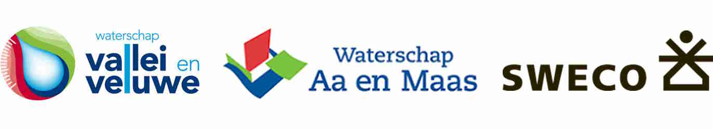
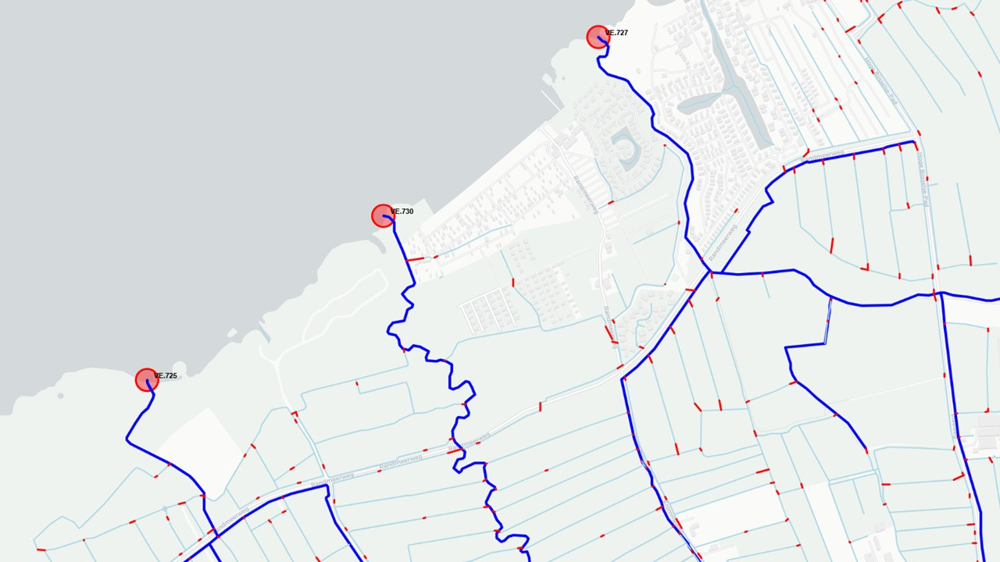

.. DrainageUnits documentation master file, created by
   sphinx-quickstart on Wed Dec 18 09:19:01 2024.

Generator Drainage Units
============================================================================================================================

`GitHub-repository <https://github.com/Sweco-NL/generator_drainage_units>`_

Basisdata waterschappen op orde?
^^^^^^^^^^^^^^^^^^^^^^^^

De basisdata (legger) van de waterschappen bestaat voor het watersysteem uit het netwerk van watergangen, alle waterregulerende kunstwerken en de afvoergebieden. Aan alle objecten zijn tabellen met karakteristieken toegevoegd. Deze data wordt gebruikt voor het beheer en voor de opbouw van (geo)hydrologische en hydraulische modellen. Binnen het waterbeheer wordt het (Hy)DAMO datamodel gebruikt om de karakteristieken van de objecten te structureren. 

Wat nog mist zijn geautomatiseerde methodes om de geometrie van de data te checken, te zorgen voor een sluitend netwerk en generieke netwerk-analyses uit te voeren. Het gaat dan specifiek ook om het bepalen welke gebieden waar naar toe stromen (afvoergebieden en afwateringseenheden) en het automatisch coderen van de watergangen en afvoergebieden. Deze analyses kunnen naast de hoofdwatergangen (in beheer bij het waterschap), ook het onderliggende netwerk van sloten meenemen.

Workflows voor hydrologische basisdata waterschappen
^^^^^^^^^^^^^^^^^^^^^^^^

Deze python-package is opgezet door Sweco Nederland binnen twee losse opdrachten voor waterschap Aa en Maas en Vallei & Veluwe. 
De public repository bevat de workflows inclusief voorbeeld-scripts en documentatie. Momenteel bevat het o.a. workflows voor voorbewerking van het waternetwerk, verbinden van de C-watergangen middels duikers, automatische toekennen van orde-codering en het afleiden van afwateringseenheden en (deel)stroomgebieden. Naast de data van het waterschap worden andere openbare datasets ook gebruikt. 

Voor meer informatie: 

- **Waterschap Vallei & Veluwe**: Harmen van de Werfhorst
- **Waterschap Aa & Maas**: Joachim Hunink
- **Sweco Nederland (Water)**: Harm Nomden / Joren van Os / Lieke van Haastregt

Hier onder is kort beschreven welke workflows zijn opgezet. Voor een uitgebreide uitleg zie `beschrijving workflows <description_workflows.html>`_. Voor vragen en opmerkingen: kijk onder Issues in de `GitHub-repository <https://github.com/Sweco-NL/generator_drainage_units>`_.

Waterschap Aa & Maas
^^^^^^^^^^^^^^^^^^^^^^^^
De vraag om op basis van benedenstroomse uitstroompunten (deel)stroomgebieden te genereren.

`GeneratorNetworkLumping <description_workflows.html#generatornetworklumping-workflow-aggregeren-deel-stroomgebieden>`_ - Workflow om voor opgegeven uitstroompunten het bovenstroomse watersysteem inclusief afwateringseenheden te lumpen (aggregeren) om stroomgebieden of deelstroomgebieden te genereren. Hierbij wordt overlap gedetecteerd en kan men aangeven hoe de deelgebieden verdeeld worden.

*GeneratorNetworkLumping - Afleiden (deel)stroomgebieden op basis van uitstroompunten*

Waterschap Vallei & Veluwe
^^^^^^^^^^^^^^^^^^^^^^^^
De vraag om afvoergebieden af te leiden tot op het diepste detailniveau op basis van een raster met een hoogtemodel (maaiveld of in dit geval grondwaterstand GHG) en een gegeven waternetwerk. Deze afvoergebiedjes worden ook wel afwateringseenheden of hydrologische eenheden genoemd. Middels netwerk-analyse en codering is het mogelijk om deze te aggregeren tot elk gewenst niveau:

`GeneratorCulvertLocations <description_workflows.html#generatorculvertlocations-workflow-duiker-locaties>`_ - Workflow die voortbouwt op een al bestaande 'duikergenerator' van het waterschap waarin de locaties van duikers voor de C-watergangen worden gezocht. Dit om na te gaan hoe het water naar de hoofdwatergangen (A/B) stroomt. Het zoeken gebeurt op basis van rekenregels, waarbij gekeken wordt naar kruisingen met (spoor)wegen en peilgebiedsgrenzen, de lengte van de duiker (hoe korter, hoe beter) en de richting van de duiker ten opzichte van de watergang. 

*GeneratorCulvertLocations - Zoeken missende duikers om te achterhalen waar het water naartoe stroomt*

`GeneratorOrderLevels <description_workflows.html#generatororderlevels-workflow-orde-codering>`_ - Workflow voor het bepalen van orde nummers en de orde-codering van de watergangen en de daaraan gelegen afvoergebieden. De `Leidraad Nederlandse Methodiek Afvoergebieden (Bakker et al, 2017) <https://kennis.hunzeenaas.nl/file_auth.php/hunzeenaas/a/aa/Leidraden_Harmoniseren_Afvoergebieden_v1.1.pdf>`_ vormt hierin de basis. De C-watergangen (niet hoofdwatergangen) worden apart meegenomen in de analyse.

.. carousel::
   :show_controls:
   :show_indicators:
   :show_dark:

   .. figure:: _static/generator_order_levels_1.jpg
      :height: 400px
      :align: center

      ..

      GeneratorOrderLevels - Bepalen van orde-nummers

   .. figure:: _static/order_levels_west_oost.jpg
      :height: 400px
      :align: center

      ..

      GeneratorOrderLevels - Orde-nummers van de watergangen voor waterschap Vallei & Veluwe

   .. figure:: _static/generator_order_levels_2.jpg
      :height: 400px
      :align: center

      ..

      GeneratorOrderLevels - Bepalen van orde-codering
*GeneratorOrderLevels - Orde-nummer en Orde-codering van watergangen (en later afwateringseenheden)*

`GeneratorDrainageUnits <description_workflows.html#generatordrainageunits-workflow-afwateringseenheden>`_ - Workflow voor het genereren van afwateringseenheden: op basis van een GHG raster 25x25m de afvoerrichting bepalen en daarmee de afwaterende eenheden. Dit met behulp van andere open source packages zoals `pyflwdir  <https://github.com/Deltares/pyflwdir>`_ en `imod-python <https://github.com/Deltares/imod-python>`_ van Deltares.

.. carousel::
   :show_controls:
   :show_indicators:
   :show_dark:

   .. figure:: _static/generator_drainage_units_1.jpg
      :height: 400px
      :align: center

      ..

      GeneratorDrainageUnits - Afleiden afwateringseenheden per watergang

   .. figure:: _static/generator_drainage_units_2.jpg
      :height: 400px
      :align: center

      ..

      GeneratorDrainageUnits - Aggregeren afwateringseenheden naar hoofdwatergangen

   .. figure:: _static/ghg_drainage_units_leuvenumsebeek.jpg
      :height: 400px
      :align: center
      
      ..

      GeneratorDrainageUnits - Afleiden afwateringseenheden Leuvenumsebeek op basis van de grondwaterstand (GHG)
*GeneratorDrainageUnits - Afleiden afwateringseenheden en stroomgebieden*

Inhoud
^^^^^^^^^^^^^^^^^^^^^^^^
.. toctree::
   :maxdepth: 2
   
   Installatie en gebruik <getting_started>
   Beschrijving workflows <description_workflows>
   API documentatie <api_docs>

