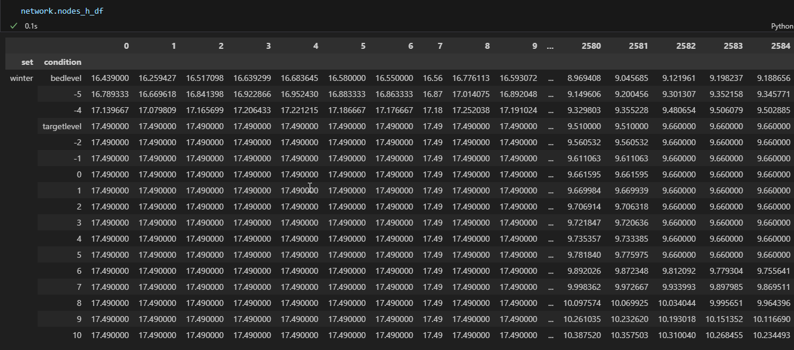

Voorbeelden
=====================

GeneratorCulvertLocations (workflow Duiker Locaties)
^^^^^^^^^^^^^^^^^^^^^^^^^^^^
Doel van deze workflow is het verbinden van de C-watergangen met de A/B-watergangen: om te bepalen welke gebieden stromen in de hoofdwatergangen van het waterschap, dat is namelijk vaak niet duidelijk of het is verweven.
De workflow bestaat uit de volgende stappen:

* zoekt alle mogelijke verbindingen (duikers) tussen losliggende C-waterdelen en de hoofdwatergangen (A/B);
* bepaald voor elke mogelijke verbinding/duiker of er een snelweg/spoor/weg of peilgebiedsgrens wordt gekruisd;
* voorziet elke mogelijke verbinding/duiker van een score op basis van criteria (kruisingen, lengte duiker, richting duiker tov watergang);
* zoekt de duikers met de hoogste scores tussen losliggende C-waterdelen en daarmee ook de verbindingen met de hoofdwatergangen (A/B);
* de richting van de C-watergangen worden gezocht door te bepalen wat de kortste afstand is naar de hoofdwatergangen.

zie ook `Issue #12 <https://github.com/Sweco-NL/generator_drainage_units/issues/12#issuecomment-2446702722>`_: Selectie beste duiker 

.. image:: assets/generator_culvert_locations.png
    :alt: Generator Culvert Locations (workflow duiker locaties)
    :width: 800px
    :align: center

GeneratorOrderLevels (workflow Orde-codering)
^^^^^^^^^^^^^^^^^^^^^^^^^^^^
Doel van deze workflow is het bepalen van orde nummers en de orde-codering voor iedere watergang en daarmee voor de afwateringseenheden/afvoergebieden die daarmee corresponderen. 
Hiervoor wordt voor de A/B-watergangen uitgegaan van de methode beschreven in de `Leidraad Harmoniseren Afvoergebieden <https://kennis.hunzeenaas.nl/file_auth.php/hunzeenaas/a/aa/Leidraden_Harmoniseren_Afvoergebieden_v1.1.pdf>`_. 
De workflow bestaat (op dit moment) uit de volgende stappen:

* De RWS-wateren waar de watergangen in uitstromen vormen de basis voor de codering (bijv. Veluwemeer: VE, IJssel: IJ);
* De A/B-watergangen die uitstromen in de RWS-wateren zijn van de 2de orde en krijgen een toevoegen waarbij het nummer binnen een bepaalde range ligt die is gespecificeerd voor het waterschap (Vallei&Veluwe: 712-760). De Leuvenumsebeek krijgt bijvoorbeeld VE.733;
* Ieder individueel watergangsdeel krijgt een opvolgend nummer (bijv. VE.733.001, VE.733.002) of er kan voor gekozen worden dit pas te doen bij splitsingen van de A/B-watergangen;
* Een instromende A/B-watergang wordt een orde hoger (3, 4, 5, etc.) en wordt als gehele zijtak ook meegenomen in de nummering;
* Bij splitsingen of confluences wordt voor het orde nummer (en daarmee ook codering) ervanuit gegaan dat als twee watergangsdelen in het verlengde van elkaar liggen, dat deze van dezelfde orde zijn.
* De C-watergangen die afstromen naar een A/B-watergang worden van een orde hoger dan de watergang waar ze instromen en krijgen dezelfde codering mee (met aanvulling C0001, C0002, ...). Hieruit kan afgeleid worden welke C-watergangen met bijbehorende afvoergebieden bij een watergang horen.

Zie ook: 
* `Issue #16 <https://github.com/Sweco-NL/generator_drainage_units/issues/16#issuecomment-2558479293>`_: Codering RWS wateren en uitstroompunten;
* `Issue #17 <https://github.com/Sweco-NL/generator_drainage_units/issues/17#issuecomment-2516835304>`_: Definitie orde A/B watergangen;
* `Issue #18 <https://github.com/Sweco-NL/generator_drainage_units/issues/18#issue-2629773652>`_: Definitie orde C watergangen;
* `Issue #19 <https://github.com/Sweco-NL/generator_drainage_units/issues/20#issuecomment-2558543651>`: Definitie orde-codering;

.. image:: assets/generator_order_levels.png
    :alt: Generator Order Levels (workflow orde-codering)
    :width: 800px
    :align: center

GeneratorDrainageUnits (workflow Orde-codering)
^^^^^^^^^^^^^^^^^^^^^^^^^^^^
Generates drainage units for each hydroobject based on a terrain model

* punt 1
* punt 2
* punt 3

GeneratorNetworkLumping (workflow genereren (deel)stroomgebieden)
^^^^^^^^^^^^^^^^^^^^^^^^^^^^
Generates upstream (sub)basins for predefined outflow points

* punt 1
* punt 2
* punt 3

.. image:: assets/generator_network_lumping.png
    :alt: Generator Network Lumping (workflow stroomgebieden)
    :width: 800px
    :align: center

